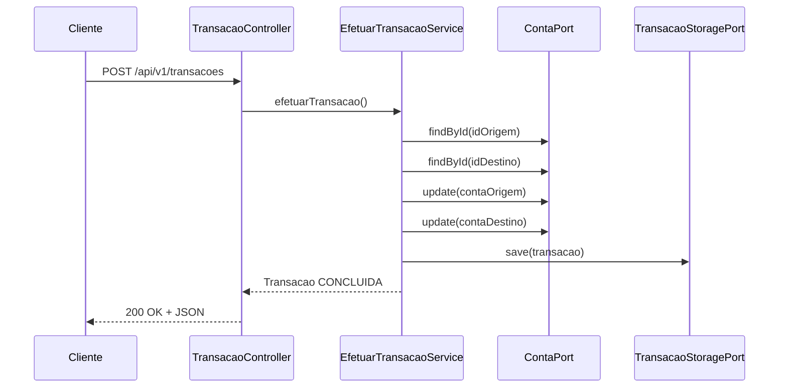

# Efetuar Transação
Sistema backend RESTful para efetuação de transações financeiras entre contas, com arquitetura hexagonal, Resilience4j, testes unitários, mutantes e concorrentes.

---

## Visão Geral

Este projeto simula uma aplicação de transação bancária, contemplando:

- API REST para efetuar transações
- Controle de saldo e limite
- Resiliência com Resilience4j (retry + circuit breaker)
- Observabilidade com Micrometer
- Arquitetura baseada em portas e adaptadores (hexagonal)
- Validação robusta de dados com Bean Validation
- Testes unitários com JUnit + Mockito
- Testes mutantes com PITest
- Testes concorrentes

---

## Tecnologias e Bibliotecas

- Java 17
- Spring Boot 3.0.4
- Spring Web / AOP / Validation
- Micrometer
- Resilience4j
- JUnit 5 / Mockito / PITest

---

## Arquitetura

A aplicação está dividida entre:

### Core (domínio)
- `domain.model`: entidades `Conta` e `Transacao`
- `domain.exception`: exceções de regra de negócio

### Application
- `application.usecase`: regra de negócio principal (`EfetuarTransacaoService`)
- `application.ports.in`: entrada (interface `EfetuarTransacaoUseCase`)
- `application.ports.out`: saída (interfaces `ContaPort`, `TransacaoStoragePort`)

### Adapters
- `adapter.in.rest`: controlador REST (`TransacaoController`)
- `adapter.out.persistence`: repositório de transações (simulado)
- `adapter.out.fake`: simula serviço externo de contas (`ContaPortImpl`)

### Observabilidade
- Micrometer + Timer para medir execução da transação

### Resiliência
- Retry e circuit breaker nos acessos a contas (fake)

---

## Como executar

```bash
# 1. Compilar o projeto
mvn clean install

# 2. Executar a aplicação
mvn spring-boot:run
```

Após o start:
```
http://localhost:8080/api/v1/transacoes
```

---

## Como testar

### Testes unitários
```bash
mvn test
```

### Testes mutantes
```bash
mvn org.pitest:pitest-maven:mutationCoverage
```
Gera relatório HTML em `target/pit-reports`

### Testes concorrentes
Executados com `TransacaoControllerConcurrencyTest`, simulando requisições paralelas com `ExecutorService`.

---

## Fluxograma da Transação



---

## Exemplo de requisição

POST `/api/v1/transacoes`

```json
{
  "idContaOrigem": "12345-6",
  "idContaDestino": "98765-4",
  "valor": 150.00
}
```

Resposta:
```json
{
  "idTransacao": "...",
  "idContaOrigem": "12345-6",
  "idContaDestino": "98765-4",
  "valor": 150.0,
  "status": "CONCLUIDA",
  "dataHora": "2025-04-07T18:00:00"
}
```

---

## Observabilidade

- Métrica `transacao.executada` com `Micrometer`
- Pode ser exportada via Actuator ou Prometheus

---


